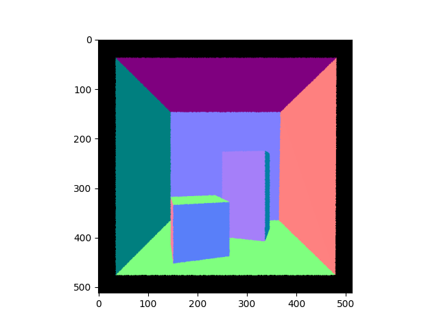
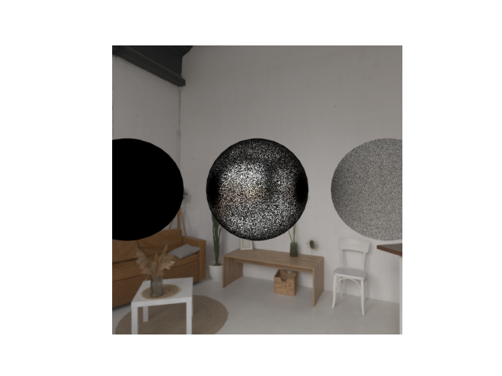
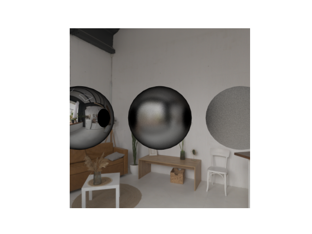
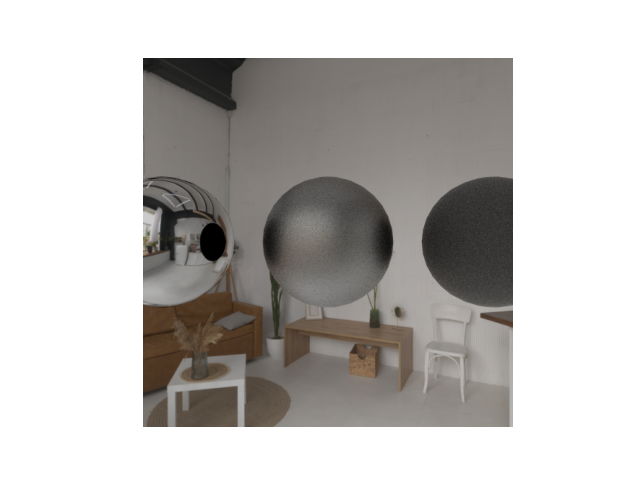
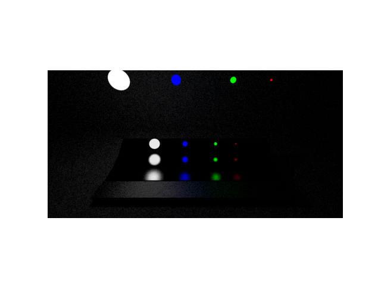
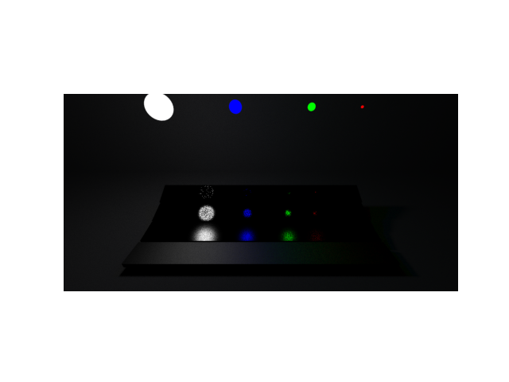
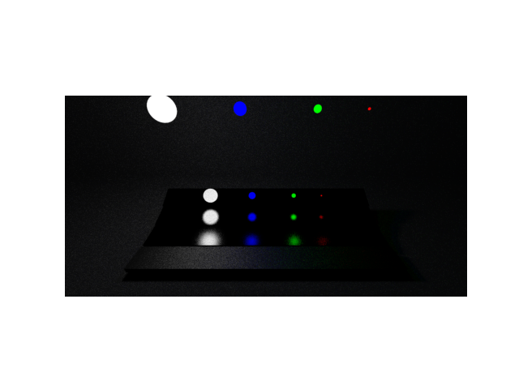

# Path-Tracer-MIrror
 A small mirror repo to show off my path tracer. I can't show the private repo and its code for now due to university policy.

## Rays, Intersections and the Camera
To program a ray tracer, it was essential to think up the ray class, camera class, intersections and hit data. The process of ray tracing can be simplified as follows. A ray originates from its origin in a defined direction. The ray then gets queried to see if it hits anything. This is determined by it's intersection with primitives. In my case, I decided to implement a ray-triangle intersector. From there, we can use barycentric coordinates and interpolate the surface normal. 

### Normals:
 

## Progressive renderer, BRDF and environment
The main focus was to add environment lighting and code the brdf. Here I added uniform, brdf and microfacet sampling. These all relate to how the rays' bounce when they hit a surface. This is based off the material. A glossier surface will make a more perfect reflection. In contrast, a rough surface will bounce in more scattered directions. A uniform sampler picks directions randomly in all directions. A brdf sampler picks directions randomly but more inline with the perfect reflection based on how glossy the material is. Microfacet attempts to model the surface at a much smaller scale even beyond the geometry and normal. Additionally, I added progressive rendering. This averages out the result over a user-defined number of samples. Additionnally, I added a random jitter to the ray direction such that it doesn't just cross through the center pixel everytime. This results in an anti aliassing effect.

### Uniform:  
    

### BRDF:  
   

### Microfacet:  
 

## LIS and MIS

In addition to adding mesh light, I added LIS and MIS. For light importance sampling, instead of simply picking a direction in line with the brdf, a random point from a random emissive surface gets sampled. Then a ray is traced to this triangle. If it hits the sampled triangle, then this light makes contribution to the point. Otherwise, it is occluded. The probability of sampling this direction is equal to the inverse of the total area of mesh lights. MIS or multiple importance sampling, we randomly pick between strategies. The pdf is adjusted according to the weights of both strategies. This means we can take advantage of BRDF and LIS in cases when one is strong and the other is weak.

### BRDF:  

Here there is low noise on the glossy surfaces but the diffuse area and background have high variance.  

### LIS:  
   
Conversely, here there is low noise on the diffuse area and background are smooth but the glossy surfaces is quite noisy.  

### MIS (50/50 BRDF-LIS):  
 
Lastly, we can see how they combine to form a better overall image. Importantly, the total number of samples is the same for all 3 images (100 spp).   

## Path Tracing
